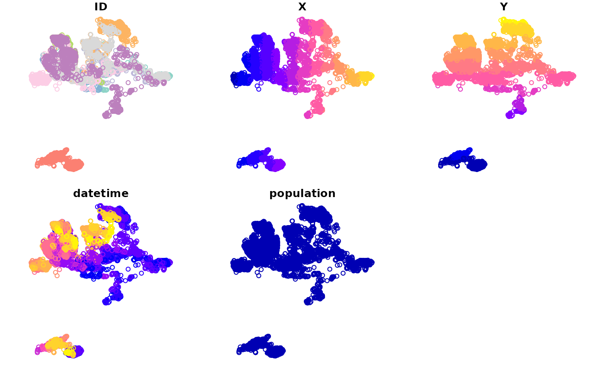
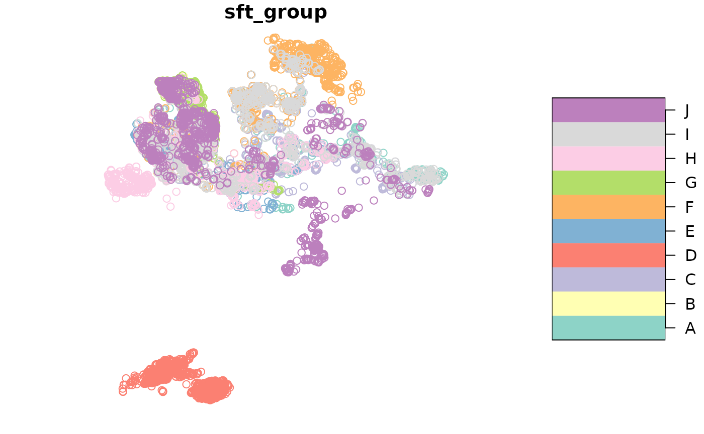

# Geometry interface and spatial measures

## Introduction

{spatsoc} v 0.2.13 provides a geometry interface and internal functions
that provide consistent spatial measures across all {spatsoc} functions.

The motivation for `get_geometry` is to allow users to supply a geometry
column instead of providing coordinates and optionally crs through the
“coords” and “crs” args. This interface is enabled by default on all
functions that accept coordinates / geometry, by leaving the coords null
and ensuring the geometry column has been set up using
[`get_geometry()`](https://docs.ropensci.org/spatsoc/reference/get_geometry.md).

Details on spatial measures below under [Spatial
measures](#spatial-measures).

------------------------------------------------------------------------

See the other vignettes for further information:

- [Introduction to
  spatsoc](https://docs.ropensci.org/spatsoc/articles/intro.html)
  - temporal grouping
  - spatiotemporal grouping with `group_pts`, `group_lines`,
    `group_polys`
  - distance based edge-list generation with `edge_dist`
- [Frequently asked questions about
  spatsoc](https://docs.ropensci.org/spatsoc/articles/faq.html)
  - install
  - function details for `group_times`, `group_pts`, `group_lines`,
    `group_polys`, `edge_dist`, `edge_nn`, and `randomizations`
  - package design including modify-by-reference, data.table column
    allocation
  - calculating summary information
- [Using spatsoc in social network
  analysis](https://docs.ropensci.org/spatsoc/articles/using-in-sna.html)
  - generating gambit-of-the-group data
  - generating observed networks
  - data stream randomization, randomized networks
  - network metrics
- [Using distance based edge-lists generating functions, dyad_id, and
  fusion_id](https://docs.ropensci.org/spatsoc/articles/using-edge-and-dyad.html)
  - generate distance based edge-lists with `edge_dist` and `edge_nn`
  - generate dyad identifiers for edge-lists with `dyad_id`
  - identify fusion events with `fusion_id`
- [Geometry
  interface](https://docs.ropensci.org/spatsoc/articles/geometry-interface-and-spatial-measures.html)
  - using `get_geometry` to setup a geometry column and use the geometry
    interface
  - details of underlying distance, direction and centroid spatial
    measures
  - converting to and from related packages
- [Interspecific
  interactions](https://docs.ropensci.org/spatsoc/articles/interspecific-interactions.html)
  - combine two movement datasets
  - identify interspecific interactions

## Setup

Load packages

``` r

library(spatsoc)
library(data.table)
#> 
#> Attaching package: 'data.table'
#> The following object is masked from 'package:base':
#> 
#>     %notin%
```

Example data and variables

``` r

# Read example data
DT <- fread(system.file('extdata', 'DT.csv', package = 'spatsoc'))

coords <- c('X', 'Y')
crs <- 32736
datetime <- 'datetime'
id <- 'ID'
```

## `get_geometry`

`get_geometry` can be used to setup a `DT` with a simple feature
geometry list column. Optionally, the input coordinates can be
transformed using the argument “output_crs”. The default output geometry
column name can be changed using the argument “geometry_colname”.

### Usage

``` r

# Get geometry
get_geometry(DT, coords = coords, crs = crs)

print(DT)
#>            ID        X       Y            datetime population
#>        <char>    <num>   <num>              <POSc>      <int>
#>     1:      A 715851.4 5505340 2016-11-01 00:00:54          1
#>     2:      A 715822.8 5505289 2016-11-01 02:01:22          1
#>     3:      A 715872.9 5505252 2016-11-01 04:01:24          1
#>     4:      A 715820.5 5505231 2016-11-01 06:01:05          1
#>     5:      A 715830.6 5505227 2016-11-01 08:01:11          1
#>    ---                                                       
#> 14293:      J 700616.5 5509069 2017-02-28 14:00:54          1
#> 14294:      J 700622.6 5509065 2017-02-28 16:00:11          1
#> 14295:      J 700657.5 5509277 2017-02-28 18:00:55          1
#> 14296:      J 700610.3 5509269 2017-02-28 20:00:48          1
#> 14297:      J 700744.0 5508782 2017-02-28 22:00:39          1
#>                        geometry
#>                     <sfc_POINT>
#>     1: POINT (715851.4 5505340)
#>     2: POINT (715822.8 5505289)
#>     3: POINT (715872.9 5505252)
#>     4: POINT (715820.5 5505231)
#>     5: POINT (715830.6 5505227)
#>    ---                         
#> 14293: POINT (700616.5 5509069)
#> 14294: POINT (700622.6 5509065)
#> 14295: POINT (700657.5 5509277)
#> 14296: POINT (700610.3 5509269)
#> 14297:   POINT (700744 5508782)
```

## Spatial measures

### Distance

The underlying distance function used depends on the crs of the
coordinates or geometry provided.

- If the crs is longlat degrees (as determined by
  [`sf::st_is_longlat()`](https://r-spatial.github.io/sf/reference/st_is_longlat.html)),
  the distance function is
  [`sf::st_distance()`](https://r-spatial.github.io/sf/reference/geos_measures.html)
  which passes to
  [`s2::s2_distance()`](https://r-spatial.github.io/s2/reference/s2_is_collection.html)
  if
  [`sf::sf_use_s2()`](https://r-spatial.github.io/sf/reference/s2.html)
  is TRUE and
  [`lwgeom::st_geod_distance()`](https://r-spatial.github.io/lwgeom/reference/geod.html)
  if
  [`sf::sf_use_s2()`](https://r-spatial.github.io/sf/reference/s2.html)
  is FALSE. The distance returned has units set according to the crs.

- If the crs is not longlat degrees (eg. NULL, `NA_crs_`, or projected),
  the distance function used is
  [`stats::dist()`](https://rdrr.io/r/stats/dist.html), maintaining
  expected behaviour from previous versions. The distance returned does
  not have units set.

Note: in both cases, if the coordinates are NA then the result will be
NA.

### Direction

The underlying distance function used depends on the crs of the
coordinates or geometry provided.

- If the crs is provided and longlat degrees (as determined by
  [`sf::st_is_longlat()`](https://r-spatial.github.io/sf/reference/st_is_longlat.html)),
  the distance function is
  [`lwgeom::st_geod_azimuth()`](https://r-spatial.github.io/lwgeom/reference/st_geod_azimuth.html).

- If the crs is provided and not longlat degrees (eg. a projected UTM),
  the coordinates or geometry are transformed to `sf::st_crs(4326)`
  before the distance is measured using
  [`lwgeom::st_geod_azimuth()`](https://r-spatial.github.io/lwgeom/reference/st_geod_azimuth.html).

- If the crs is NULL or `NA_crs_`, the distance function cannot be used
  and an error is returned.

The crs for direction functions (eg. `direction_step`,
`direction_to_centroid`) should be either longlat or a crs that can be
transformed to `sf::st_crs(4326)`. A user can check their crs by using
the function `sf::st_can_transform(src = crs, dst = 4326)`.

If a user provides a crs that is not longlat and cannot be transformed
to 4326, they will receive an internal error with the following
structure:

`"In CPL_transform(x, crs, aoi, pipeline, reverse, desired_accuracy, : GDAL Error 6: Cannot find coordinate operations from..."`

### Centroid

The underlying centroid function used depends on the crs of the
coordinates or geometry provided.

- If the crs is longlat degrees (as determined by
  [`sf::st_is_longlat()`](https://r-spatial.github.io/sf/reference/st_is_longlat.html))
  and
  [`sf::sf_use_s2()`](https://r-spatial.github.io/sf/reference/s2.html)
  is TRUE, the distance function is
  [`sf::st_centroid()`](https://r-spatial.github.io/sf/reference/geos_unary.html)
  which passes to
  [`s2::s2_centroid()`](https://r-spatial.github.io/s2/reference/s2_boundary.html).

- If the crs is longlat degrees but
  [`sf::sf_use_s2()`](https://r-spatial.github.io/sf/reference/s2.html)
  is FALSE, the centroid calculated will be incorrect. See
  [`sf::st_centroid()`](https://r-spatial.github.io/sf/reference/geos_unary.html).

- If the crs is not longlat degrees (eg. NULL, NA_crs\_, or projected),
  the centroid function used is mean.

Note: if the input is length 1, the input is returned directly without
any processing.

The `distance_to_centroid`, `direction_to_centroid` and
`leader_direction_group` expect a centroid column named ‘centroid’ when
the geometry interface is used. Ensure the `centroid_group` function has
been used with the geometry interface before running these functions.

The following warning may be returned when centroid functions are used
with longlat coordinates / geometry and the {s2} package is not
available or
[`sf::sf_use_s2()`](https://r-spatial.github.io/sf/reference/s2.html) is
`FALSE`. Please set `sf::sf_use_s2(TRUE)` and try again.

## Converting from other packages

Instead of using
[`get_geometry()`](https://docs.ropensci.org/spatsoc/reference/get_geometry.md),
coming from other packages, we can convert the objects to data.tables
for processing with {spatsoc}. Caution: {spatsoc}’s expectation is that
the “geometry” column is `sfc_POINT` representing each relocation.

### Converting from {sftrack}

``` r

library(sftrack)
data("raccoon")
raccoon$timestamp <- as.POSIXct(raccoon$timestamp, "EST")
burstz <- list(id = raccoon$animal_id, month = as.POSIXlt(raccoon$timestamp)$mon)
my_track <- as_sftrack(raccoon,
  group = burstz, time = "timestamp",
  error = NA, coords = c("longitude", "latitude")
)

DT_sftrack <- as.data.table(my_track)

print(DT_sftrack)
#> (id: TTP-058, month: 0)
#> (id: TTP-058, month: 0)
#> (id: TTP-058, month: 0)
#> (id: TTP-058, month: 0)
#> (id: TTP-058, month: 0)
#> (id: TTP-041, month: 1)
#> (id: TTP-041, month: 1)
#> (id: TTP-041, month: 1)
#> (id: TTP-041, month: 1)
#> (id: TTP-041, month: 1)
#>      animal_id latitude longitude           timestamp height  hdop  vdop    fix
#>         <char>    <num>     <num>              <POSc>  <int> <num> <num> <fctr>
#>   1:   TTP-058       NA        NA 2019-01-18 19:02:30     NA   0.0   0.0     NO
#>   2:   TTP-058 26.06945 -80.27906 2019-01-18 20:02:30      7   6.2   3.2     2D
#>   3:   TTP-058       NA        NA 2019-01-18 21:02:30     NA   0.0   0.0     NO
#>   4:   TTP-058       NA        NA 2019-01-18 22:02:30     NA   0.0   0.0     NO
#>   5:   TTP-058 26.06769 -80.27431 2019-01-18 23:02:30    858   5.1   3.2     2D
#>  ---                                                                           
#> 441:   TTP-041 26.07068 -80.28009 2019-02-01 14:02:30     17   1.8   2.4     3D
#> 442:   TTP-041 26.07069 -80.27996 2019-02-01 15:02:05     -6   2.4   2.2     3D
#> 443:   TTP-041       NA        NA 2019-02-01 16:02:30     NA   0.0   0.0     NO
#> 444:   TTP-041 26.07074 -80.28012 2019-02-01 17:02:09      7   1.6   3.0     3D
#> 445:   TTP-041 26.07071 -80.28013 2019-02-01 18:02:07     13   1.6   2.7     3D
#>         sft_group                   geometry
#>      <c_grouping>                <sfc_POINT>
#>   1: <s_group[2]>                POINT EMPTY
#>   2: <s_group[2]> POINT (-80.27906 26.06945)
#>   3: <s_group[2]>                POINT EMPTY
#>   4: <s_group[2]>                POINT EMPTY
#>   5: <s_group[2]> POINT (-80.27431 26.06769)
#>  ---                                        
#> 441: <s_group[2]> POINT (-80.28009 26.07068)
#> 442: <s_group[2]> POINT (-80.27996 26.07069)
#> 443: <s_group[2]>                POINT EMPTY
#> 444: <s_group[2]> POINT (-80.28012 26.07074)
#> 445: <s_group[2]> POINT (-80.28013 26.07071)
```

### Converting from {move2}

``` r

library(move2)
fishers <- mt_read(mt_example(file = "fishers.csv.gz"))
DT_move2 <- as.data.table(fishers)

print(DT_move2)
#>         event-id visible           timestamp behavioural-classification
#>            <i64>  <lgcl>              <POSc>                     <fctr>
#>     1: 170635808    TRUE 2011-02-11 17:30:00                       <NA>
#>     2: 170635809    TRUE 2011-02-11 17:40:00                       <NA>
#>     3: 170635810    TRUE 2011-02-11 17:50:00                       <NA>
#>     4: 170635811    TRUE 2011-02-11 18:00:00                       <NA>
#>     5: 170635812    TRUE 2011-02-11 18:06:13                       <NA>
#>    ---                                                                 
#> 47343: 170705304    TRUE 2011-05-28 09:04:37                       <NA>
#> 47344: 170705305    TRUE 2011-05-28 09:06:58                       <NA>
#> 47345: 170705306    TRUE 2011-05-28 09:08:59                       <NA>
#> 47346: 170705307    TRUE 2011-05-28 09:10:24                       <NA>
#> 47347: 170705308    TRUE 2011-05-28 09:12:00                       <NA>
#>        eobs:battery-voltage eobs:fix-battery-voltage
#>                     <units>                  <units>
#>     1:              NA [mV]                  NA [mV]
#>     2:              NA [mV]                  NA [mV]
#>     3:              NA [mV]                  NA [mV]
#>     4:              NA [mV]                  NA [mV]
#>     5:              NA [mV]                  NA [mV]
#>    ---                                              
#> 47343:              NA [mV]                  NA [mV]
#> 47344:              NA [mV]                  NA [mV]
#> 47345:              NA [mV]                  NA [mV]
#> 47346:              NA [mV]                  NA [mV]
#> 47347:              NA [mV]                  NA [mV]
#>        eobs:horizontal-accuracy-estimate eobs:key-bin-checksum
#>                                  <units>                 <i64>
#>     1:                            NA [m]                  <NA>
#>     2:                            NA [m]                  <NA>
#>     3:                            NA [m]                  <NA>
#>     4:                            NA [m]                  <NA>
#>     5:                            NA [m]                  <NA>
#>    ---                                                        
#> 47343:                            NA [m]                  <NA>
#> 47344:                            NA [m]                  <NA>
#> 47345:                            NA [m]                  <NA>
#> 47346:                            NA [m]                  <NA>
#> 47347:                            NA [m]                  <NA>
#>        eobs:speed-accuracy-estimate eobs:start-timestamp eobs:status
#>                             <units>               <POSc>       <ord>
#>     1:                     NA [m/s]                 <NA>        <NA>
#>     2:                     NA [m/s]                 <NA>        <NA>
#>     3:                     NA [m/s]                 <NA>        <NA>
#>     4:                     NA [m/s]                 <NA>        <NA>
#>     5:                     NA [m/s]                 <NA>        <NA>
#>    ---                                                              
#> 47343:                     NA [m/s]                 <NA>        <NA>
#> 47344:                     NA [m/s]                 <NA>        <NA>
#> 47345:                     NA [m/s]                 <NA>        <NA>
#> 47346:                     NA [m/s]                 <NA>        <NA>
#> 47347:                     NA [m/s]                 <NA>        <NA>
#>        eobs:temperature eobs:type-of-fix eobs:used-time-to-get-fix ground-speed
#>                 <units>           <fctr>                   <units>      <units>
#>     1:          NA [°C]             <NA>                   110 [s]     NA [m/s]
#>     2:          NA [°C]             <NA>                   110 [s]     NA [m/s]
#>     3:          NA [°C]             <NA>                   110 [s]     NA [m/s]
#>     4:          NA [°C]             <NA>                   110 [s]     NA [m/s]
#>     5:          NA [°C]             <NA>                    80 [s]     NA [m/s]
#>    ---                                                                         
#> 47343:          NA [°C]             <NA>                    37 [s]     NA [m/s]
#> 47344:          NA [°C]             <NA>                    58 [s]     NA [m/s]
#> 47345:          NA [°C]             <NA>                    59 [s]     NA [m/s]
#> 47346:          NA [°C]             <NA>                    24 [s]     NA [m/s]
#> 47347:          NA [°C]             <NA>                   110 [s]     NA [m/s]
#>        heading height-above-ellipsoid manually-marked-outlier sensor-type
#>        <units>                <units>                  <lgcl>      <fctr>
#>     1:  NA [°]                 NA [m]                      NA         gps
#>     2:  NA [°]                 NA [m]                      NA         gps
#>     3:  NA [°]                 NA [m]                      NA         gps
#>     4:  NA [°]                 NA [m]                      NA         gps
#>     5:  NA [°]                 NA [m]                      NA         gps
#>    ---                                                                   
#> 47343:  NA [°]                 NA [m]                      NA         gps
#> 47344:  NA [°]                 NA [m]                      NA         gps
#> 47345:  NA [°]                 NA [m]                      NA         gps
#> 47346:  NA [°]                 NA [m]                      NA         gps
#> 47347:  NA [°]                 NA [m]                      NA         gps
#>        individual-local-identifier                   geometry
#>                             <fctr>                <sfc_POINT>
#>     1:                          F1                POINT EMPTY
#>     2:                          F1                POINT EMPTY
#>     3:                          F1                POINT EMPTY
#>     4:                          F1                POINT EMPTY
#>     5:                          F1 POINT (-73.86015 42.79528)
#>    ---                                                       
#> 47343:                          M5  POINT (-73.4067 42.83955)
#> 47344:                          M5 POINT (-73.40663 42.83997)
#> 47345:                          M5 POINT (-73.40644 42.84002)
#> 47346:                          M5  POINT (-73.4063 42.84024)
#> 47347:                          M5                POINT EMPTY
```

## Converting to other packages

After processing with {spatsoc}, optionally convert output to work with
other packages. Caution: {spatsoc}’s expectation is that users take
their input data.table through any required functions in {spatsoc}
before converting to other packages or using eg. {dplyr}. Intermixing
packages between {spatsoc} functions can lead to issues with
{data.table} class or column allocation. See more details under Package
Design in [FAQ](https://docs.ropensci.org/spatsoc/articles/faq.html).

An example of a potential issue with intermixing packages between
spatsoc functions is that attributes such as the sf column’s bbox aren’t
automatically updated when subsetting with data.table. This impacts the
bbox returned, and also the bbox used for plotting. The recommendation
is to run all required {spatsoc} functions then convert to standard
spatial formats as described below for further processing and
visualization.

``` r

library(sf)
#> Linking to GEOS 3.12.1, GDAL 3.8.4, PROJ 9.4.0; sf_use_s2() is TRUE
DT[, st_bbox(geometry)]
#>      xmin      ymin      xmax      ymax 
#>  693394.8 5490131.4  716205.1 5514805.9
DT[1:10, st_bbox(geometry)]
#>      xmin      ymin      xmax      ymax 
#>  693394.8 5490131.4  716205.1 5514805.9

DT[, plot(geometry)]
```


    #> NULL
    DT[1:10, plot(geometry)]


    #> NULL

    # Note the bbox can also be manually recomputed
    DT[1:10, st_bbox(st_sfc(geometry, recompute_bbox = TRUE))]
    #>      xmin      ymin      xmax      ymax 
    #>  714823.4 5505227.2  715872.9 5505837.2
    DT[1:10, plot(st_sfc(geometry, recompute_bbox = TRUE))]


    #> NULL

### Converting to {sf}

``` r

DT_sf <- st_as_sf(DT, sf_column_name = 'geometry')
print(DT_sf)
#> Simple feature collection with 14297 features and 5 fields
#> Geometry type: POINT
#> Dimension:     XY
#> Bounding box:  xmin: 693394.8 ymin: 5490131 xmax: 716205.1 ymax: 5514806
#> Projected CRS: WGS 84 / UTM zone 36S
#> First 10 features:
#>    ID        X       Y            datetime population                 geometry
#> 1   A 715851.4 5505340 2016-11-01 00:00:54          1 POINT (715851.4 5505340)
#> 2   A 715822.8 5505289 2016-11-01 02:01:22          1 POINT (715822.8 5505289)
#> 3   A 715872.9 5505252 2016-11-01 04:01:24          1 POINT (715872.9 5505252)
#> 4   A 715820.5 5505231 2016-11-01 06:01:05          1 POINT (715820.5 5505231)
#> 5   A 715830.6 5505227 2016-11-01 08:01:11          1 POINT (715830.6 5505227)
#> 6   A 715829.4 5505332 2016-11-01 10:01:18          1 POINT (715829.4 5505332)
#> 7   A 715306.6 5505837 2016-11-01 12:00:49          1 POINT (715306.6 5505837)
#> 8   A 715349.7 5505644 2016-11-01 14:01:23          1 POINT (715349.7 5505644)
#> 9   A 715224.1 5505661 2016-11-01 16:00:51          1 POINT (715224.1 5505661)
#> 10  A 714823.4 5505659 2016-11-01 18:01:16          1 POINT (714823.4 5505659)
plot(DT_sf)
```



### Converting to {sftrack}

``` r

library(sftrack)

# First convert to sf as above
DT_sf <- st_as_sf(DT, sf_column_name = 'geometry')
# Then convert to sftrack
DT_sftrack <- as_sftrack(DT_sf, group = c(id = id), time = datetime)

head(DT_sftrack)
#> Sftrack with 6 features and 7 fields (0 empty geometries) 
#> Geometry : "geometry" (XY, crs: WGS 84 / UTM zone 36S) 
#> Timestamp : "datetime" (POSIXct in UTC) 
#> Groupings : "sft_group" (*id*) 
#> -------------------------------
#>   ID        X       Y            datetime population sft_group
#> 1  A 715851.4 5505340 2016-11-01 00:00:54          1   (id: A)
#> 2  A 715822.8 5505289 2016-11-01 02:01:22          1   (id: A)
#> 3  A 715872.9 5505252 2016-11-01 04:01:24          1   (id: A)
#> 4  A 715820.5 5505231 2016-11-01 06:01:05          1   (id: A)
#> 5  A 715830.6 5505227 2016-11-01 08:01:11          1   (id: A)
#> 6  A 715829.4 5505332 2016-11-01 10:01:18          1   (id: A)
#>                   geometry
#> 1 POINT (715851.4 5505340)
#> 2 POINT (715822.8 5505289)
#> 3 POINT (715872.9 5505252)
#> 4 POINT (715820.5 5505231)
#> 5 POINT (715830.6 5505227)
#> 6 POINT (715829.4 5505332)
plot(DT_sftrack)
```



### Converting to {move2}

``` r

library(move2)

# Convert to a {move2} object using mt_as_move2
DT_move2 <- mt_as_move2(DT,
  time_column = datetime,
  track_id_column = id,
  sf_column_name = 'geometry'
)

print(DT_move2)
#> A <move2> with `track_id_column` "ID" and `time_column` "datetime"
#> Containing 10 tracks lasting on average 120 days in a
#> Simple feature collection with 14297 features and 5 fields
#> Geometry type: POINT
#> Dimension:     XY
#> Bounding box:  xmin: 693394.8 ymin: 5490131 xmax: 716205.1 ymax: 5514806
#> Projected CRS: WGS 84 / UTM zone 36S
#> First 10 features:
#>    ID        X       Y            datetime population                 geometry
#> 1   A 715851.4 5505340 2016-11-01 00:00:54          1 POINT (715851.4 5505340)
#> 2   A 715822.8 5505289 2016-11-01 02:01:22          1 POINT (715822.8 5505289)
#> 3   A 715872.9 5505252 2016-11-01 04:01:24          1 POINT (715872.9 5505252)
#> 4   A 715820.5 5505231 2016-11-01 06:01:05          1 POINT (715820.5 5505231)
#> 5   A 715830.6 5505227 2016-11-01 08:01:11          1 POINT (715830.6 5505227)
#> 6   A 715829.4 5505332 2016-11-01 10:01:18          1 POINT (715829.4 5505332)
#> 7   A 715306.6 5505837 2016-11-01 12:00:49          1 POINT (715306.6 5505837)
#> 8   A 715349.7 5505644 2016-11-01 14:01:23          1 POINT (715349.7 5505644)
#> 9   A 715224.1 5505661 2016-11-01 16:00:51          1 POINT (715224.1 5505661)
#> 10  A 714823.4 5505659 2016-11-01 18:01:16          1 POINT (714823.4 5505659)
#> Track features:
#>    ID
#> 1   A
#> 2   B
#> 3   C
#> 4   D
#> 5   E
#> 6   F
#> 7   G
#> 8   H
#> 9   I
#> 10  J
plot(DT_move2)
```


